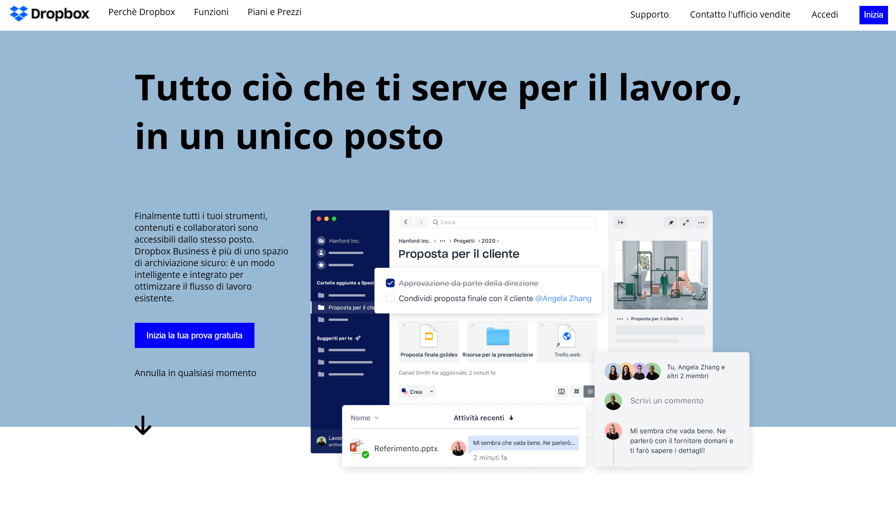
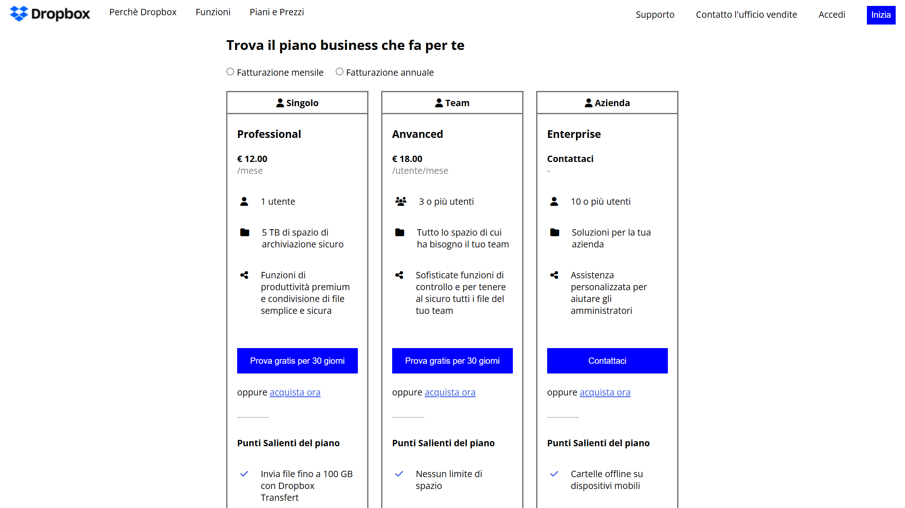
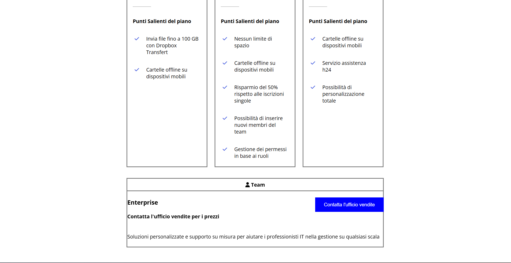
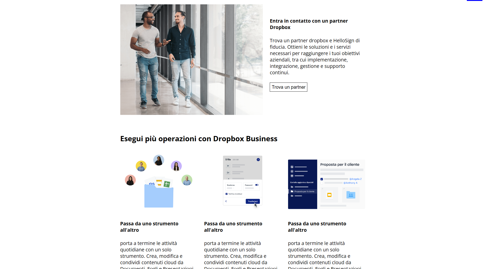
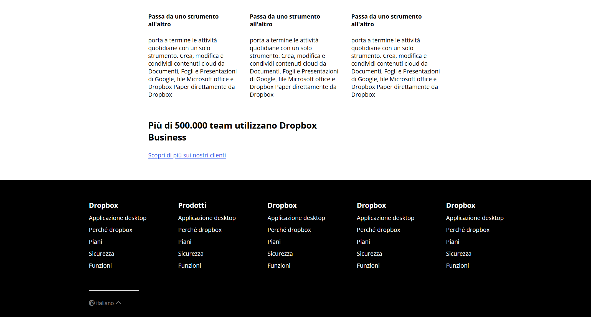

<h1 align="center">Layout Dropbox</h1>

  Esercizio svolto durante il corso Boolean per esercitarmi nella riproduzione del layout della homepage di Dropbox con HTML e CSS.

## Obiettivo

- Riprodurre il layout fornito nello screenshot, cercando di essere il più fedeli possibile.
- Analizzare il layout con commenti per individuare le macroaree (header, hero, sezioni centrali, footer).
- Procedere per passi:
  - prima struttura a blocchi;
  - poi aggiunta dei dettagli sezione per sezione.

## Approccio e buone pratiche

- Mantenere un codice ordinato e leggibile, senza incartarsi su una singola feature.
- Creare classi riutilizzabili per gli elementi ricorrenti, centralizzando le regole comuni in CSS.
- Non lavorare ancora sul responsive completo, ma usare dove possibile unità relative senza aggiungere complessità inutile.

## Anteprima

## Risorse utilizzate

- Font principale: **Open Sans** (Google Fonts)
- Icone: **Font Awesome**

## Tecnologie utilizzate

- HTML  
- CSS
