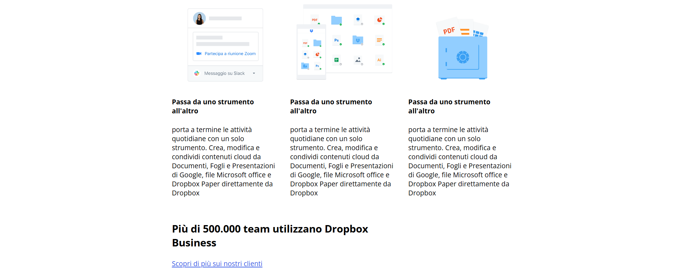
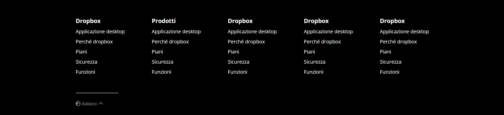

  

<h1 align="center">Layout Dropbox</h1>

Pagina HTML/CSS che riproduce un layout ispirato alla homepage di Dropbox,
con focus sulla suddivisione in sezioni e sulla cura del dettaglio grafico.

## Obiettivo

- Riprodurre il layout fornito nello screenshot, cercando di essere il più fedeli possibile
- Analizzare il layout con commenti per individuare le macroaree
  (header, sezione hero, sezioni centrali, footer)
- Procedere per passi:
  - prima struttura a blocchi
  - poi aggiunta dei dettagli sezione per sezione

## Approccio e buone pratiche

- Mantenere un codice ordinato e leggibile, senza bloccarsi su una singola feature
- Creare classi riutilizzabili per gli elementi ricorrenti, centralizzando le regole comuni in CSS
- Non lavorare ancora sul responsive completo, ma iniziare a usare dove possibile unità relative
  senza introdurre complessità non necessaria

## Anteprima

  
  
  
  

## Risorse utilizzate

- Font principale: **Open Sans** (Google Fonts)  
- Icone: **Font Awesome**

## Tecnologie utilizzate

- HTML5  
- CSS3
